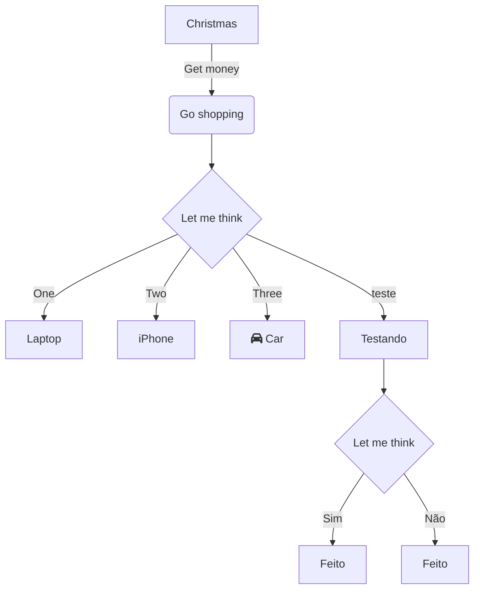
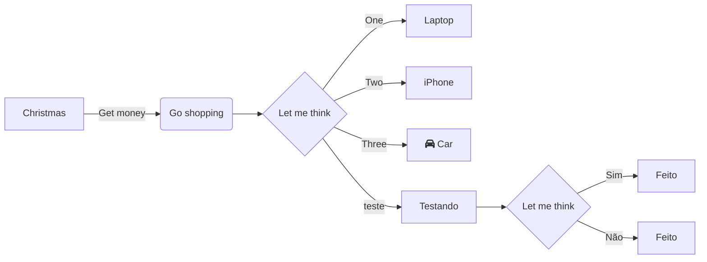

# Fluxogramas

## Fluxograma Cima -> Baixo

```mermaid
graph TD
    A[Christmas] -->|Get money| B(Go shopping)
    B --> C{Let me think}
    C -->|One| D[Laptop]
    C -->|Two| E[iPhone]
    C -->|Three| F[fa:fa-car Car]
    C -->|teste| J[Testando]
    J --> H{Let me think}
    H -->|Sim| H1[Feito]
    H -->|Não| H2[Feito]

```
## Fluxograma Esquerda -> Direita

```mermaid
graph LR
    A[Christmas] -->|Get money| B(Go shopping)
    B --> C{Let me think}
    C -->|One| D[Laptop]
    C -->|Two| E[iPhone]
    C -->|Three| F[fa:fa-car Car]
    C -->|teste| J[Testando]
    J --> H{Let me think}
    H -->|Sim| H1[Feito]
    H -->|Não| H2[Feito]

```